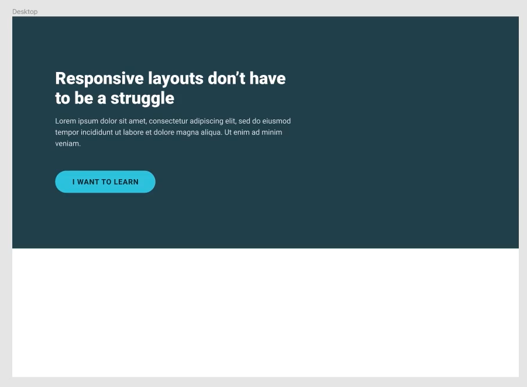

# Day 5 - Challenge 3

This day was all about the challenges. Kevin challenged us to create a layout from scratch using the principles we've learned in the past week including setting max-width, relative units, padding, container-ization and percentage widths and heights.

