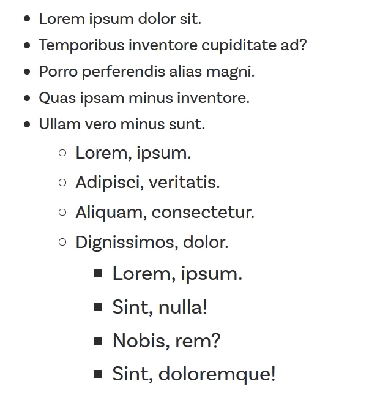

# Day 6 - Why you shouldn't use `em`s for font-size

Today kevin is teaching us some reasons it may not be the best idea to use ems for font sizes as well as showing [an article](https://css-tricks.com/tale-width-max-width/) about the tale between the two element width properties.

`width` and `max-width`

Kevin goes over some of the previous video content again in order to drive home the concept that because ems are a relative unit that get their measurment from the parent element you can get some pretty horrible cascading behaviour from them if you set them on certain elements such as a `<ul>` element;

The main challenge with using `ems` with font-size is that it can create a compounding effect with nested elements text growing in size.

Since we can set the font-size of elements with the `rem` unit, this means that all font-sizes on our site can be changed at a later date by simply updating the `<html>` elements font-size.

